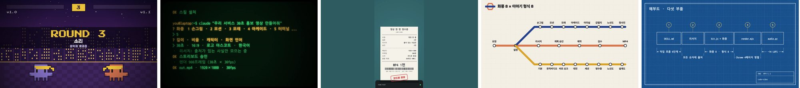
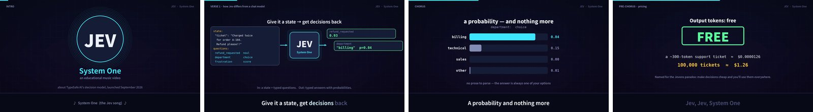
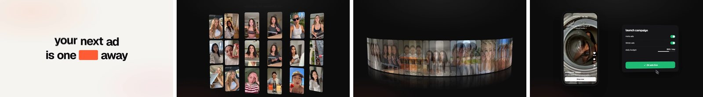

# code-video

English | [한국어](README.ko.md)


*One script, five looks. Every frame above is drawn in code.* [Watch the 45-second intro](https://github.com/Changroro/code-video/releases/download/v1.2.0/CodeVideo_intro_en.mp4), made with this skill.

An agent skill that researches a topic and turns it into a short video drawn entirely in code. No video-generation model and no stock footage: the agent writes the scenes, renders them frame by frame, and hands you an MP4.

## How it works

1. **Everything is code.** Each frame is a function of time drawn on an HTML canvas, captured by headless Chrome, and encoded by ffmpeg. Music and sound effects are synthesized in code too, so the same input always renders the same video.
2. **Research first.** The agent collects facts with sources, checks the headline numbers against the original sentences, and takes the palette and fonts from the brand. Every number on screen has a source.
3. **You approve the plan.** It asks for a look, a story format, and the settings (length, aspect ratio, characters, on-screen language), then shows the storyboard, palette, and sound plan before building anything.
4. **Look × format.** The look is how it is drawn; the story format is how it is told. Any look works with any format.
5. **Checked before delivery.** Stills, transitions, a sweep of the whole timeline, and loudness (-14 LUFS) are checked before delivery, and a credited look is laid side by side with its original's frames until every signature item is on screen.

## Looks

| Look | Feel | Credit |
|---|---|---|
| Hand-drawn + 8-bit minis (default) | playful, sketchbook | [@nahiddotai](https://www.threads.com/@nahiddotai/post/DdmtD3zDtkB) |
| Brand motion graphics | clean, official | [@digitalstrategyai](https://www.threads.com/@digitalstrategyai/post/DdpAYbcgAj0) |
| Sand art | warm, story-like | [@Michaelzsguo](https://x.com/Michaelzsguo/status/2102592355165782312) |
| 16-bit arcade | game, energetic | original |
| CRT terminal | developer, retro | original |
| Thermal receipt | printed, tactile | original |
| Transit map | diagram, orderly | original |
| Blueprint | technical, precise | original |

New looks are added over time, and pull requests for new ones are welcome (see [Contributing](#contributing)). The original looks share one scene API, so one script renders in any of them. Here is the same "steps" scene in several:


## Story formats

| Format | Structure | Fits | Credit |
|---|---|---|---|
| Standard promo (default) | hook → title → steps → big number → ending | any company, product, or service | original |
| Versus | rounds between two options, then a tally | A vs B, old vs new, before vs after | original |
| Session | commands and outputs that show how it is used | tools, APIs, workflows | original |
| Receipt | itemised list, total, stamp | prices, plans, a year in review | original |
| Route map | lines, stations, interchanges | business areas, lineups, histories | original |
| Spec sheet | parts, each with one spec | components, architectures, anatomies | original |
| Lyric music video | an original song, one fact per line | memorable explainers | [@goodside](https://x.com/goodside/status/2102852546620744010) |
| Beat-synced footage | cuts on a song's beats over real clips | your own clips and a licensed song | [@twoclipping](https://x.com/twoclipping/status/2102554209166000267) |

Versus, session, receipt (9:16), route map, and spec sheet, each made with this skill about this skill:



## Credit

Credited looks and formats adapt ideas their creators shared publicly after the Claude Opus 5.5 release; the links are in the tables above. This repository does not contain their prompts. The guides in `references/` are our own write-ups, and the skill wraps every look and format in the same research, approval, and QA steps. The looks and formats marked original were designed for this skill. The default look comes from [@nahiddotai](https://www.threads.com/@nahiddotai)'s ["Introducing Opus 5.5" launch video](https://www.threads.com/@nahiddotai/post/DdmtD3zDtkB) and [the prompt they shared](https://www.threads.com/@nahiddotai/post/Ddm0OgZkuQx).

Four highlight frames from each credited creator's original video:

**Hand-drawn + 8-bit minis**, from [@nahiddotai](https://www.threads.com/@nahiddotai/post/DdmtD3zDtkB)


**Brand motion graphics**, from [@digitalstrategyai](https://www.threads.com/@digitalstrategyai/post/DdpAYbcgAj0)


**Sand art**, from [@Michaelzsguo](https://x.com/Michaelzsguo/status/2102592355165782312)


**Lyric music video**, from [@goodside](https://x.com/goodside/status/2102852546620744010)


**Beat-synced footage**, from [@twoclipping](https://x.com/twoclipping/status/2102554209166000267)


## Install

Pick one.

**skills CLI** (Claude Code, Codex and other agents):

```bash
npx skills add Changroro/code-video -g
```

**Claude Code plugin** from the [changroro marketplace](https://github.com/Changroro/plugins):

```
/plugin marketplace add Changroro/plugins
/plugin install code-video@changroro
```

**Manual**: clone into your agent's skills directory.

```bash
git clone https://github.com/Changroro/code-video ~/.claude/skills/code-video   # Claude Code
git clone https://github.com/Changroro/code-video ~/.codex/skills/code-video    # Codex
```

Requirements: Node.js 18+ with npm, ffmpeg built with libx264, Google Chrome, and [uv](https://docs.astral.sh/uv/) for the helper scripts (numpy and scipy for sound, librosa for beat detection, installed on the fly).

## Use

Ask your agent for a video. Name a look or a format if you already know it, or let it suggest one from the topic.

- "Make a 30-second promo video for https://example.com"
- "Make a sand-art video of our company's history"
- "Compare our two plans as an arcade versus video"
- "Explain our CLI as a terminal session"

## Contents

| Path | Purpose |
|---|---|
| `SKILL.md` | Workflow: look, format, and settings → research → plan approval → build → QA → render |
| `.claude-plugin/plugin.json` | Claude Code plugin manifest (the skill stays at the repo root) |
| `template/kit.js` | Canvas kit: hand-drawn primitives, text and kinetic type, camera, transitions, sprites, minis, video clips |
| `template/{handdrawn,motion,sand,lyric,beat}.js` | Style modules that draw each credited original's signature pieces |
| `template/{arcade,terminal,thermal,transit,blueprint}.js` | Look modules with one shared scene API and a signature format scene each |
| `template/render.mjs` | Deterministic frame capture with parallel pages, piped to ffmpeg, with the audio track muxed in |
| `template/minis-ai.js` | Ready-made mini characters for AI-related topics |
| `references/` | Research protocol, storyboard patterns, looks, story formats, kit API, QA checklist |
| `references/styles/` | Guides for the credited looks and formats, each with the original's signature checklist |
| `scripts/` | Font download, logo background cleanup, contact sheets, reference sheets against the original, music and sound synthesis, beat detection |

Fonts are downloaded at build time from Google Fonts and jsDelivr (SIL Open Font License) and are not bundled.

The characters in `template/minis-ai.js` are unofficial fan art. Product names and trademarks belong to their owners.

## Contributing

Pull requests are welcome, especially new looks and formats.

- **A new look or format**: add a style module in `template/` (pure functions of time, no state between frames), a guide in `references/styles/` with a Signature table that maps every trait to a helper, and a row in the tables of `SKILL.md` and both READMEs.
- **Adapting someone's public work**: credit the creator with a link, write the guide in your own words (do not paste their prompt), and add four frames from the original to `docs/styles/` so everyone can compare.
- **Check it**: render stills with `node render.mjs stills ...` and, for a credited style, build `scripts/reference_sheet.py <key> <video> <out.jpg>` to put your frames under the original's.
- Bug reports and fixes to the engine, fonts, or guides are just as welcome. Open an issue first for large changes.

## License

[MIT](LICENSE)
